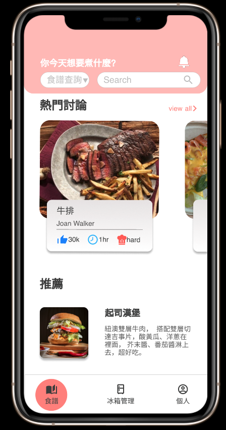

# 料理語音助手

**開發團隊：輔大資管系學生，由李偉成、吳景煥、徐柏勛、林芯緹、陳泓棣共同開發完成**
**獲獎：大專校院資訊應用服務創新競賽－產學合作組佳作、大學專題優秀組別**

使用工具：JavaScript / React / Node.js / firebase / Azure API / Git

系統簡介：利用 Azure API 提供的意圖辨識與 STT（Speech To Text）讓使用者透過語音能操控 app，功能包括查詢食譜、食譜步驟（上、下一步）、查詢冰箱食材等，解決使用者必須一邊做菜一邊看食譜的困擾。

[介紹影片](https://youtu.be/6bVTywDfLlc) [發表影片](https://youtu.be/i9l10Vul5vE)
[專題發表簡報 1](https://drive.google.com/drive/folders/1-dNEDOTo2K06wKE_NUFrE9NIJxMiG1O4?usp=drive_link)
[專題發表簡報 2](https://drive.google.com/drive/folders/1-Zix7RWhAYPuRj_EALHoCLE4xdsXW3SA?usp=drive_link)

功能解說：

使用者可透過以下命令口頭操縱 app

- **查詢食譜**，範例：「幫我查詢有關豬肉和高麗菜的相關食譜」
- **食譜步驟**，範例：「上一步驟」、「下一步驟」、「移動至第四步驟」
- **食譜步驟並朗讀食譜內容**，範例：「幫我念出第三步驟」
- **查詢食材**，範例：「冰箱裡面有牛奶嗎」
- **新增食材至冰箱**，範例：「幫我把牛奶加到冰箱」
